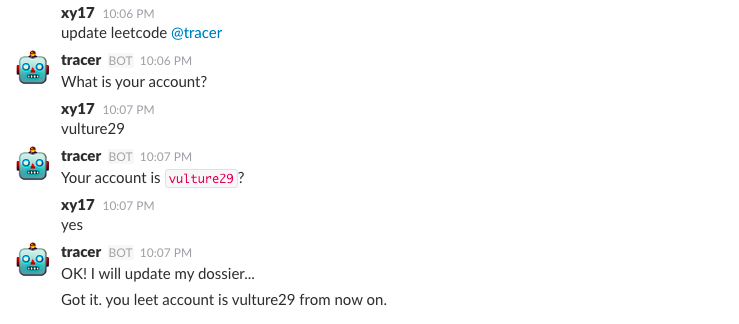

#Leetbot

Leetbot is a bot that can trace your leecode progress, and compete it with your teammates on slack. It will update the leaderboard daily, and count each week's result.


### Deployment

Our program should always be running so we strongly recommend that all the following operation should be done on a cloud machine(e.g. AWS EC2).

#### Install code.

```bash
git clone https://github.com/LakeGap/LeetBot.git
cd LeetBot
npm install
```
#### Update Slack bot token.

1. [Create a new slack team](https://slack.com).

2. Create a bot team member. Click [/services/new/bot](https://my.slack.com/services/new/bot). For more information about bot-users, see [documentation](https://api.slack.com/bot-users).

3. Copy slack bot token.

4. Update environment variables "LEETBOT_KEY" to your bot token on your own cloud machine.

   In windows, just run:

   ```
   setx LEETBOT_KEY "<slackbot-token>"
   # You will then need to close the cmd window and reopen.
   ```
   In other systems, we can set them in your shell, like in `.bash_profile`:

   ```
   # Edit .bash_profile to have:
   export LEETBOT_KEY ="<slackbot-token>"
   # Then reload
   $ source ~/.bash_profile
   ```

#### Run the code.
Run the command on your cloud machine.
```
node bot.js
```

### Configuration and Usage
Use direct message to your bot to configure/register yourself/check progress.
#### command introduction:

| Format        | Usage           |
| ------------- |:-------------:|
| my name is [slackname]      | register/update username (required for first time use) |
| signup [leetcode username]      | register leetcode account (required for first time use)      |
| update [leetcode username] | update leetcode account      |
| my progress  | show user's current progress (week star, rank, submit history etc.)  |
| status | show team's progress (current stars and leaderboard)     |
| who am i  | check user profile     |

one conversations example:





### Contribution
This bot is still under test within my own leetcode coding group, anyone are welcome to contribute. Here is something I want to do next:
1. Add a GitHub module that can automatically upload your daily submits to GitHub repo.
2. Develop a interface that allow people to upload their slack bot token, provide bot service for their bot.
3. Code refactory, develop API, publish this bot as a npm package.
